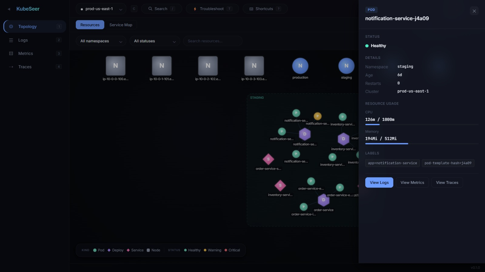
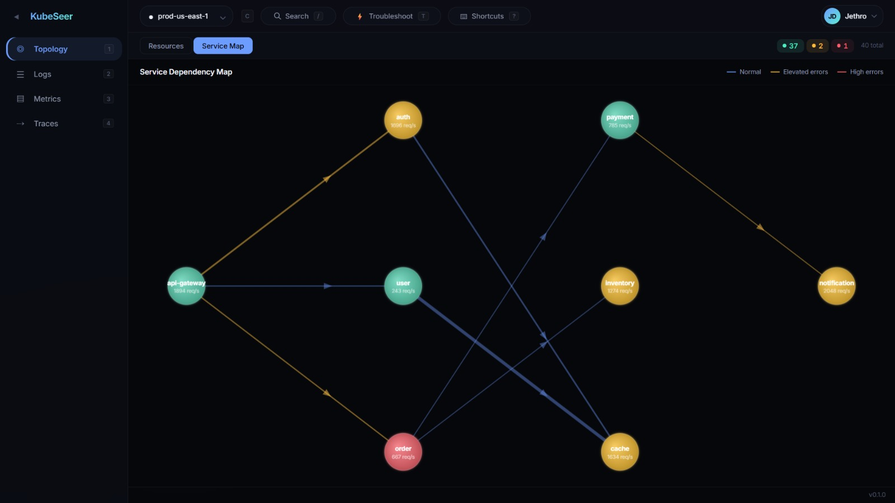
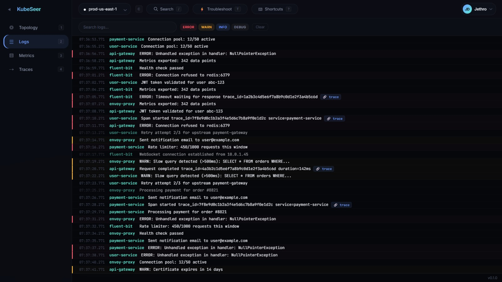
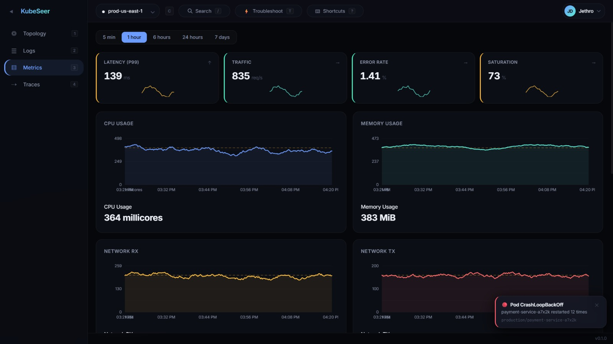
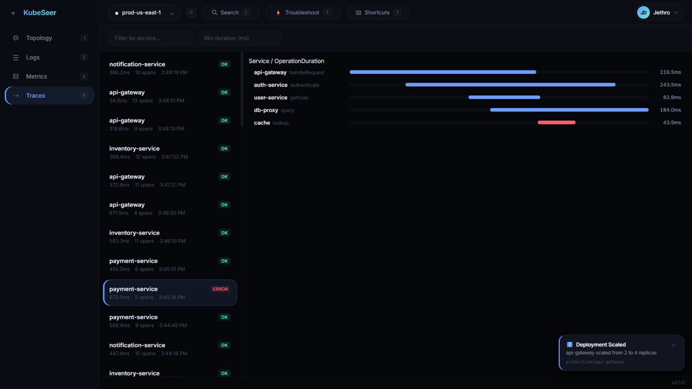
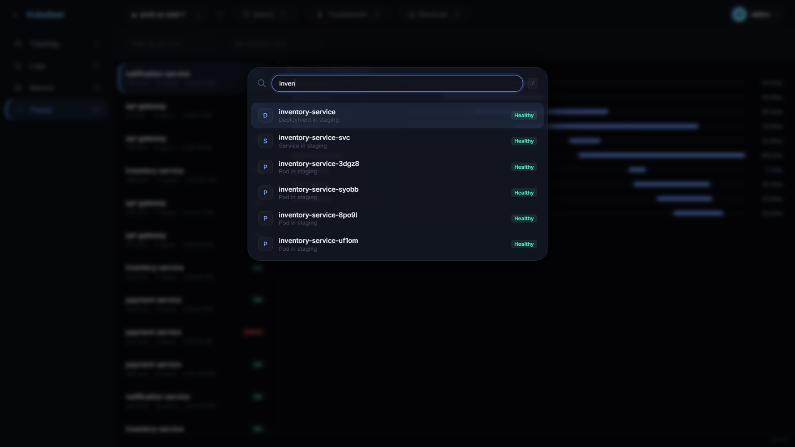
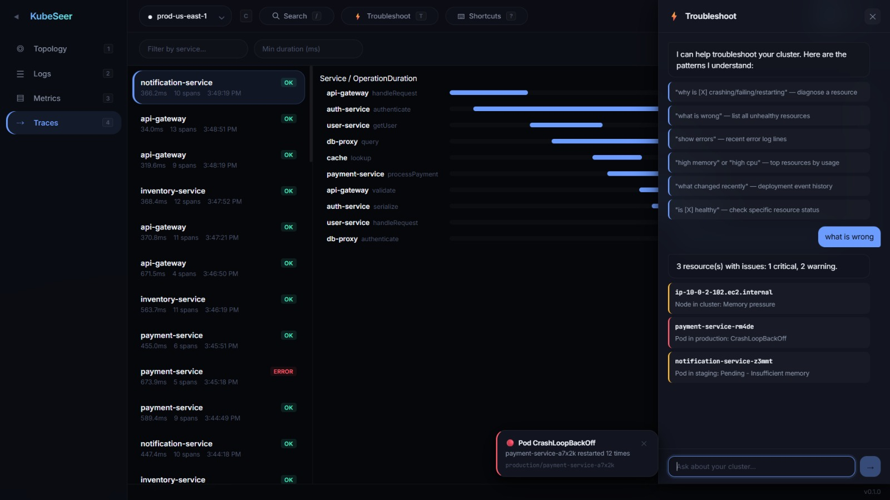

# KubeSeer

A high-performance Kubernetes observability GUI built with Rust and React. Single binary, zero config, all observability pillars unified.


## What is KubeSeer?

KubeSeer unifies topology visualization, log streaming, metrics dashboards, distributed tracing, and automated troubleshooting into a single binary that reads your kubeconfig and opens in your browser.

### Screenshots









**The problem:** DevOps teams cobble together 3-5 tools (kubectl, Grafana, Jaeger, Lens) to understand their clusters. Enterprise alternatives cost $50k+/year. The official K8s Dashboard was archived in 2026.

**Our solution:** One binary. Zero config. All pillars.

## Features

| Feature | Description |
|---------|-------------|
| **Topology** | Force-directed graph with namespace clustering, inter-namespace repulsion, hierarchy header row. Shapes = kinds, colors = health. |
| **Service Map** | L-R hierarchical dependency graph (BFS layout) showing traffic flow between services |
| **Logs** | Virtual scroll (1M+ lines @ 60fps), severity filtering, log-to-trace correlation |
| **Metrics** | Golden Signals (latency/traffic/errors/saturation) + time-series charts with deployment timeline |
| **Traces** | Waterfall diagram with span detail, p95 bottleneck detection |
| **Troubleshoot** | Rule-based engine — ask "why is X crashing?" and it correlates resources, logs, and deploys |
| **Multi-cluster** | Instant switching with full state isolation per cluster |
| **Keyboard-first** | `1-4` views, `/` search, `T` troubleshoot, `C` cluster, `?` help |

## Architecture

```
┌─────────────────────────────────────────────────────┐
│              Single Rust Binary (~50MB)             │
│                                                     │
│  ┌──────────────────┐  ┌────────────────────────┐   │
│  │  Axum + Tokio    │  │  Embedded React SPA    │   │
│  │  HTTP + WebSocket│  │  Canvas + Zustand      │   │
│  └──────────────────┘  └────────────────────────┘   │
│                                                     │
│  ┌──────────────────┐  ┌────────────────────────┐   │
│  │  kube-rs Client  │  │  Resource Graph        │   │
│  │  Watch Streams   │  │  Broadcast + Diff      │   │
│  └──────────────────┘  └────────────────────────┘   │
└─────────────────────────────────────────────────────┘
         │                    │                    │
         ▼                    ▼                    ▼
   Kubernetes API      Prometheus (opt)    OpenTelemetry (opt)
```

**Backend:** Rust (Axum, tokio, kube-rs, rustls) — targets <100MB RAM, <5% CPU for 1000 pods  
**Frontend:** React 18, TypeScript, Canvas rendering, Zustand stores, d3-force layout  
**Security:** Localhost-only default, TLS required for remote, credentials never on disk

## Quick Start

```bash
# Build frontend
cd frontend && pnpm install && pnpm run build && cd ..

# Build & run
cargo run -- --no-open --port 9090

# Open http://127.0.0.1:9090
```

The app ships with deterministic mock data for demo purposes. Reads `~/.kube/config` automatically when connected to real clusters.

## Technical Highlights

- **Custom physics engine** — d3-force with namespace clustering (intra-group attraction) + inter-namespace repulsion (groups push apart). Hierarchy nodes pinned to header row.
- **Deterministic mock data** — Seeded PRNG (mulberry32) generates stable 7-day datasets per cluster. Switch clusters and back = identical graphs.
- **Troubleshoot engine** — 200 lines of TypeScript that parses 7 intent patterns and correlates data across stores. No LLM, no API key, instant response.
- **Canvas rendering** — Radial gradient nodes (3D sphere effect), bezier curve edges, namespace boundary detection. All at 60fps via requestAnimationFrame.
- **173 tests** — 79 Rust (unit + integration + property-based) + 94 TypeScript (stores, layout engine, troubleshoot engine, stress tests)

## Development

See [CONTRIBUTING.md](CONTRIBUTING.md) for setup instructions.

```bash
# Run tests
cargo test                    # Backend (79 tests)
cd frontend && pnpm test      # Frontend (94 tests)

# Development mode
cargo run                     # Backend serves at random port
cd frontend && pnpm run dev   # Vite dev server with API proxy
```

## Configuration

| Flag | Env Var | Default | Description |
|------|---------|---------|-------------|
| `--host` | `KUBESEER_HOST` | `127.0.0.1` | Bind address |
| `--port` | `KUBESEER_PORT` | `0` (random) | Bind port |
| `--kubeconfig` | `KUBECONFIG` | `~/.kube/config` | Kubeconfig path |
| `--tls` | `KUBESEER_TLS` | `false` | Enable TLS |
| `--no-open` | `KUBESEER_NO_OPEN` | `false` | Don't open browser |
| `--log-level` | `KUBESEER_LOG_LEVEL` | `info` | Log level |

## Project Structure

```
├── src/                    # Rust backend
│   ├── api/                # Axum routes (REST + WebSocket)
│   ├── auth/               # Kubeconfig, sessions, middleware
│   ├── cluster/            # Connection manager, watchers, resource graph
│   └── config.rs           # CLI + env config (clap)
├── frontend/src/           # React frontend
│   ├── components/         # UI components (topology, logs, metrics, traces)
│   ├── stores/             # Zustand state (cluster, logs, metrics, ui)
│   ├── hooks/              # useWebSocket, useKeyboardShortcuts, useTheme
│   └── lib/                # Troubleshoot engine, mock data, utilities
├── tests/                  # Rust integration tests
├── .kiro/specs/            # Requirements, design, tasks, iteration log
└── Cargo.toml              # Optimized release profile (LTO, strip)
```

## License

Apache License 2.0 — see [LICENSE](LICENSE) for details.
